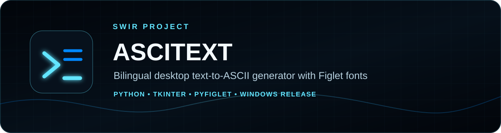
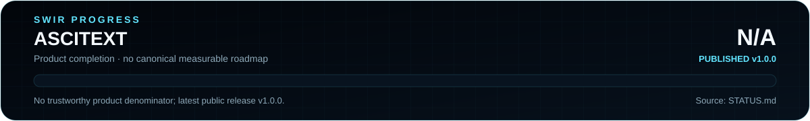

<!-- SWIR-README-STANDARD:v2 -->

<div align="center">



<br>


[](https://github.com/Swir)
[](https://github.com/Swir/ASCITEXT/stargazers)

<br>

[**Highlights**](#-highlights) · [**Quick Start**](#-quick-start) · [**Languages**](#-language-versions) · [**Status**](STATUS.md) · [**Releases**](#-releases)

</div>


## 📍 Project Status



| Item | Status |
|---|---|
| Current state | Published utility — v1.0.0 |
| UI | Tkinter / ttk |
| Text engine | pyfiglet |
| Languages | Separate Polish and English application files |
| Latest public release | [v1.0.0](https://github.com/Swir/ASCITEXT/releases/tag/v1.0.0) |
| Product completion | **N/A** — no canonical measurable roadmap/denominator exists |
| Detailed status | [STATUS.md](STATUS.md) |

The release version, font count, package size and documentation completeness are not treated as product-completion percentages.

## 🚀 Overview

**ASCITEXT** is a lightweight desktop utility that turns ordinary text into Figlet-style ASCII artwork. The repository contains separate Polish and English Tkinter applications. Users can choose from the fonts exposed by `pyfiglet`, set output width and alignment, generate text art and copy the result to the clipboard.

The application's own ASCII artwork is a core feature. The project's documentation progress visualization, however, follows the SWIR SVG-only standard and does not use character-art progress meters.

## ✨ Highlights

| Feature | What it does |
|---|---|
| 🔤 Text to ASCII | Converts normal text into Figlet-style ASCII output |
| 🎭 Figlet font list | Loads the fonts available through `pyfiglet.FigletFont.getFonts()` |
| ↔️ Width control | Lets the user set a numeric output width; otherwise defaults to 100 |
| 📐 Alignment | Supports left, center and right output alignment |
| 📋 Clipboard | Copies generated output through `pyperclip` |
| 🌙 Desktop UI | Uses Tkinter/ttk with a dark interface and scrollable result area |
| 🌍 PL / EN | Provides separate Polish and English program files |
| 🔗 Author shortcut | Opens the Swir GitHub profile from the application |

## ⚙️ Quick Start

### Recommended — Windows release

Download **[ASCITEXT v1.0.0](https://github.com/Swir/ASCITEXT/releases/tag/v1.0.0)**. The verified public release includes separate Polish and English EXE files plus a Windows x64 ZIP and SHA256 checksum.

### From source

```bash
git clone https://github.com/Swir/ASCITEXT.git
cd ASCITEXT
python -m pip install pyfiglet pyperclip
```

Run English:

```bash
python ASCItext_EN.py
```

Run Polish:

```bash
python ASCItext.py
```

## 📋 Requirements / Compatibility

- Python with Tkinter available.
- Runtime packages: `pyfiglet` and `pyperclip`.
- The current release workflow builds and syntax-checks both applications using **Python 3.11** on `windows-latest`.
- The public v1.0.0 package is a Windows build.
- Broader Python-version compatibility is not claimed here because the repository does not currently maintain a cross-version test matrix.

## 🌍 Language Versions

| Language | Source file | Release asset |
|---|---|---|
| 🇵🇱 Polish | `ASCItext.py` | `ASCITEXT-PL.exe` |
| 🇬🇧 English | `ASCItext_EN.py` | `ASCITEXT-EN.exe` |

Both versions expose the same main workflow: enter text, choose a Figlet font, set width/alignment, generate output and copy it.

## 🎮 Usage / Workflow

1. Enter text in the input field.
2. Choose a font from the `pyfiglet` font list.
3. Set an output width; invalid/non-numeric width input falls back to 100.
4. Choose left, center or right alignment.
5. Generate the ASCII artwork.
6. Copy the result to the clipboard when needed.

## 🧠 Technology / Architecture

| Layer | Technology / role |
|---|---|
| GUI | Tkinter + ttk + `ScrolledText` |
| ASCII rendering | pyfiglet |
| Clipboard | pyperclip |
| Browser shortcut | Python `webbrowser` |
| Packaging | PyInstaller in GitHub Actions |
| Release verification | `py_compile` for both source files before Windows builds |

```text
ASCITEXT/
├── ASCItext.py       # Polish version
├── ASCItext_EN.py    # English version
├── STATUS.md         # truthful product status / progress source note
├── assets/
│   ├── app_icon.svg
│   └── readme/
│       ├── hero.svg
│       ├── progress-card.svg
│       ├── progress-mini.svg
│       └── progress-template.svg
├── tools/
│   └── readme_progress.py
└── .github/workflows/
```

## 🧪 Documentation Verification

```bash
python tools/readme_progress.py --check
```

The docs-only workflow checks generated SVG files, required embeddings and retired **documentation progress-meter** patterns. It intentionally does not reject ASCII artwork created by the application itself.

## 📦 Releases

Latest verified public release: **[ASCITEXT v1.0.0](https://github.com/Swir/ASCITEXT/releases/tag/v1.0.0)**.

Verified release assets include:

- `ASCITEXT-EN.exe`
- `ASCITEXT-PL.exe`
- `ASCITEXT-v1.0.0-Windows-x64.zip`
- `ASCITEXT-v1.0.0-Windows-x64.zip.sha256`

The release workflow compiles both source files, builds both Windows EXEs with PyInstaller, packages the ZIP and writes its SHA256 checksum.

## ⚠️ Limitations

- The Polish and English variants are separate source files rather than a shared runtime localization layer.
- Font availability is determined by the installed `pyfiglet` package.
- The repository has no canonical measurable product roadmap, so product-completion progress remains **N/A** instead of being inferred from the v1.0.0 release.

## 🔎 Search Keywords

`ascii art generator` • `ascii text generator` • `figlet gui` • `pyfiglet gui` • `python ascii generator` • `tkinter ascii art` • `text to ascii art` • `terminal banner generator` • `ascii logo maker` • `python desktop text tool` • `figlet desktop app` • `bilingual ascii generator` • `windows ascii art app` • `pyperclip ascii art` • `ascitext`


<div align="center">


### `TYPE • RENDER • COPY`

⭐ **If ASCITEXT is useful, consider leaving a star.**

[**← SWIR profile**](https://github.com/Swir) · [**All projects →**](https://github.com/Swir?tab=repositories)

</div>
